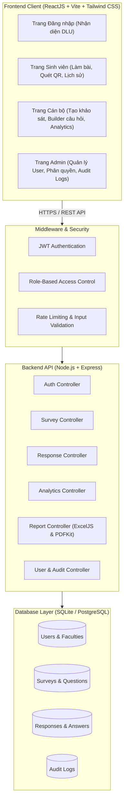
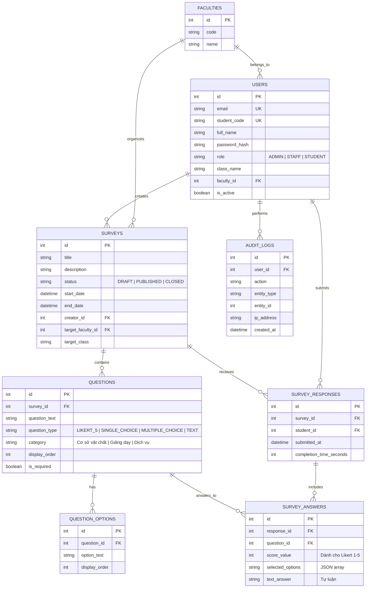

# 📚 WIKI DỰ ÁN: HỆ THỐNG KHẢO SÁT MỨC ĐỘ HÀI LÒNG SINH VIÊN (DLU)
> **Trường Đại học Đà Lạt — Khoa Công nghệ Thông tin**  
> *Triết lý giáo dục: "Thụ nhân – Khai phóng – Bản sắc"*

---

## 📑 MỤC LỤC

1. [Giới thiệu & Mục tiêu Đề tài](#1-giới-thiệu--mục-tiêu-đề-tài)
2. [Kiến trúc Hệ thống (System Architecture)](#2-kiến-trúc-hệ-thống-system-architecture)
3. [Cấu trúc Cơ sở Dữ liệu (Database ERD & Schema)](#3-cấu-trúc-cơ-sở-dữ-liệu-database-erd--schema)
4. [Phân quyền & Ma trận Chức năng (RBAC Matrix)](#4-phân-quyền--ma-trận-chức-năng-rbac-matrix)
5. [Chi tiết 6 Phân hệ (Modules) Nghiệp vụ](#5-chi-tiết-6-phân-hệ-modules-nghiệp-vụ)
6. [Danh mục RESTful API Endpoints](#6-danh-mục-restful-api-endpoints)
7. [Tài liệu Triển khai Cloud (Vercel + Render + UptimeRobot 24/24)](#7-tài-liệu-triển-khai-cloud)
8. [Bộ Kiểm thử Tự động (Automated Testing Suite)](#8-bộ-kiểm-thử-tự-động)

---

## 1. Giới thiệu & Mục tiêu Đề tài

Hệ thống **Khảo sát Mức độ Hài lòng của Sinh viên DLU** là ứng dụng Web full-stack được xây dựng nhằm tin học hóa và nâng cao tính minh bạch, khách quan trong công tác đảm bảo chất lượng giáo dục tại Trường Đại học Đà Lạt.

### 🎯 Mục tiêu chính:
- **Thu thập ý kiến sinh viên**: Đánh giá cơ sở vật chất (giảng đường, phòng máy A27/A28, thư viện), chất lượng giảng dạy và dịch vụ hỗ trợ sinh viên.
- **Trực quan hóa dữ liệu**: Biểu đồ hóa thời gian thực kết quả khảo sát theo thang đo Likert 5 mức độ và trắc nghiệm.
- **Xuất báo cáo hành chính**: Tạo file Excel 2 sheets và file PDF chuẩn văn bản hành chính theo nhận diện thương hiệu DLU.
- **Bảo mật & Chống gian lận**: Chống nộp bài trùng lặp bằng Database Transaction & Unique Constraint, xác thực JWT và phân quyền 3 vai trò chặt chẽ.

---

## 2. Kiến trúc Hệ thống (System Architecture)



---

## 3. Cấu trúc Cơ sở Dữ liệu (Database ERD & Schema)



---

## 4. Phân quyền & Ma trận Chức năng (RBAC Matrix)

| Chức năng / Quyền hạn | Sinh viên (STUDENT) | Cán bộ Khảo sát (STAFF) | Quản trị viên (ADMIN) |
| :--- | :---: | :---: | :---: |
| Đăng nhập hệ thống (Email / MSSV / Google DLU) | ✅ | ✅ | ✅ |
| Xem danh sách khảo sát đang mở & làm bài | ✅ | ❌ | ❌ |
| Xem lịch sử các bài khảo sát đã tham gia | ✅ | ❌ | ❌ |
| Tạo phiếu khảo sát mới & Soạn thảo câu hỏi | ❌ | ✅ | ✅ |
| Xuất bản (Publish), Đóng hoặc Nhân bản khảo sát | ❌ | ✅ | ✅ |
| Lấy mã QR & Link chia sẻ phiếu khảo sát | ❌ | ✅ | ✅ |
| Xem biểu đồ phân tích thống kê Likert / Trắc nghiệm | ❌ | ✅ | ✅ |
| Lọc kết quả theo Khoa / Khóa học / Lớp | ❌ | ✅ | ✅ |
| Xuất báo cáo thống kê Excel (.xlsx 2 sheets) | ❌ | ✅ | ✅ |
| Xuất báo cáo văn bản hành chính PDF (PDFKit) | ❌ | ✅ | ✅ |
| Quản lý tài khoản người dùng & Đổi mật khẩu | ❌ | ❌ | ✅ |
| Xem nhật ký hoạt động hệ thống (Audit Logs) | ❌ | ❌ | ✅ |

---

## 5. Chi tiết 6 Phân hệ (Modules) Nghiệp vụ

### Module 1: Xác thực & Phân quyền (Authentication & Authorization)
- Đăng nhập bảo mật bằng Email trường `@dlu.edu.vn`, Mã số sinh viên (MSSV) hoặc tài khoản Google Workspace DLU.
- Cơ chế JWT tự động gắn kèm Bearer Token vào Request Header qua Axios Interceptor.
- Tự động nhận diện khóa học và lớp sinh viên dựa trên mã số sinh viên (VD: `2312741` -> Sinh viên K47 Khoa CNTT).

### Module 2: Quản lý Khảo sát & Bộ tạo câu hỏi (Question Builder)
- Trình soạn thảo câu hỏi linh hoạt hỗ trợ 4 dạng câu hỏi chuẩn:
  1. **Thang đo Likert 5 mức**: 1 sao (Rất không hài lòng) đến 5 sao (Rất hài lòng).
  2. **Trắc nghiệm đơn (Single Choice)**: 1 đáp án duy nhất.
  3. **Trắc nghiệm nhiều lựa chọn (Multiple Choice)**: Chọn nhiều đáp án.
  4. **Câu hỏi tự luận (Open-ended Text)**: Góp ý xây dựng, đề xuất ý kiến.
- Hỗ trợ phân loại nhóm tiêu chí: *Cơ sở vật chất, Giảng dạy, Dịch vụ hỗ trợ*.

### Module 3: Thu thập Ý kiến & Chống nộp trùng (Response Collector)
- Sinh mã QR tự động (`qrcode.react`) độ phân giải cao, hỗ trợ tải ảnh PNG để in ấn hoặc dán tại lớp học.
- **Ràng buộc duy nhất**: `UNIQUE(survey_id, student_id)` ngăn chặn hoàn toàn việc làm bài nhiều lần.
- Đảm bảo tính toàn vẹn dữ liệu bằng Database Transaction: Nếu lưu chi tiết câu trả lời thất bại, toàn bộ phản hồi sẽ được rollback.

### Module 4: Phân tích & Trực quan hóa Biểu đồ (Analytics & Visualization)
- Tự động tính điểm trung bình tổng thể và điểm trung bình theo từng nhóm tiêu chí.
- Biểu đồ thanh ngang (Horizontal Bar Chart) hiển thị phân bổ điểm sao Likert.
- Biểu đồ tròn (Doughnut Chart) hiển thị tỷ lệ % lựa chọn đáp án trắc nghiệm.

### Module 5: Xuất Báo cáo Excel & PDF (Report Generation)
- **File Excel (.xlsx)**: Tạo bởi `ExcelJS` gồm 2 sheet:
  - *Sheet 1*: Bảng tổng hợp số liệu, tỷ lệ tham gia và điểm trung bình từng câu hỏi.
  - *Sheet 2*: Dữ liệu thô (Raw Data) chi tiết từng phản hồi của sinh viên.
- **File PDF**: Tạo bởi `PDFKit`, nhúng sẵn font Unicode tiếng Việt Roboto, định dạng chuẩn thể thức văn bản báo cáo hành chính của Trường Đại học Đà Lạt.

### Module 6: Quản trị Hệ thống & Nhật ký Audit (Admin & Audit Logs)
- Thêm mới, chỉnh sửa thông tin, đặt lại mật khẩu và khóa/mở khóa tài khoản người dùng.
- Nhật ký Audit ghi lại mọi hành vi: `LOGIN`, `CREATE_SURVEY`, `UPDATE_SURVEY`, `SUBMIT_RESPONSE`, `EXPORT_REPORT`.

---

## 6. Danh mục RESTful API Endpoints

### 🔐 1. Xác thực (Authentication)
| Method | Endpoint | Quyền | Mô tả |
| :--- | :--- | :---: | :--- |
| `POST` | `/api/auth/login` | Public | Đăng nhập bằng Email / MSSV + Mật khẩu |
| `POST` | `/api/auth/google-dlu` | Public | Đăng nhập bằng Email Google Workspace DLU |
| `GET` | `/api/auth/me` | Logged In | Lấy thông tin tài khoản hiện tại từ JWT |
| `PUT` | `/api/auth/profile` | Logged In | Cập nhật thông tin cá nhân & Đổi mật khẩu |

### 📋 2. Quản lý Khảo sát (Surveys)
| Method | Endpoint | Quyền | Mô tả |
| :--- | :--- | :---: | :--- |
| `GET` | `/api/surveys` | STAFF / ADMIN | Danh sách khảo sát do cán bộ tạo |
| `GET` | `/api/surveys/student-available` | STUDENT | Danh sách khảo sát đang mở cho sinh viên |
| `GET` | `/api/surveys/:id` | Logged In | Xem chi tiết khảo sát & danh sách câu hỏi |
| `POST` | `/api/surveys` | STAFF / ADMIN | Tạo mới một phiếu khảo sát |
| `PUT` | `/api/surveys/:id` | STAFF / ADMIN | Cập nhật thông tin phiếu khảo sát |
| `PATCH` | `/api/surveys/:id/status` | STAFF / ADMIN | Đổi trạng thái khảo sát (DRAFT / PUBLISHED / CLOSED) |
| `POST` | `/api/surveys/:id/duplicate` | STAFF / ADMIN | Nhân bản khảo sát thành bản mới |
| `DELETE` | `/api/surveys/:id` | STAFF / ADMIN | Xóa phiếu khảo sát |

### ✍️ 3. Phản hồi Khảo sát (Responses)
| Method | Endpoint | Quyền | Mô tả |
| :--- | :--- | :---: | :--- |
| `POST` | `/api/responses` | STUDENT | Nộp câu trả lời bài khảo sát |
| `GET` | `/api/responses/check/:surveyId` | STUDENT | Kiểm tra sinh viên đã làm khảo sát này chưa |
| `GET` | `/api/responses/my-history` | STUDENT | Xem lịch sử các bài khảo sát đã nộp |

### 📊 4. Thống kê & Báo cáo (Analytics & Reports)
| Method | Endpoint | Quyền | Mô tả |
| :--- | :--- | :---: | :--- |
| `GET` | `/api/analytics/survey/:id` | STAFF / ADMIN | Lấy số liệu thống kê chi tiết & điểm số biểu đồ |
| `GET` | `/api/reports/:id/excel` | STAFF / ADMIN | Xuất và tải file Excel (.xlsx) |
| `GET` | `/api/reports/:id/pdf` | STAFF / ADMIN | Xuất và tải file PDF báo cáo tiếng Việt |
| `GET` | `/api/reports/history` | STAFF / ADMIN | Lịch sử tra cứu các đợt khảo sát qua các năm |

### 🛡️ 5. Quản trị Người dùng & Audit (Admin)
| Method | Endpoint | Quyền | Mô tả |
| :--- | :--- | :---: | :--- |
| `GET` | `/api/users` | ADMIN | Danh sách toàn bộ người dùng trong hệ thống |
| `POST` | `/api/users` | ADMIN | Tạo mới tài khoản người dùng |
| `PUT` | `/api/users/:id` | ADMIN | Cập nhật thông tin hoặc quyền người dùng |
| `PATCH` | `/api/users/:id/status` | ADMIN | Khóa hoặc Mở khóa tài khoản |
| `GET` | `/api/users/audit-logs` | ADMIN | Xem toàn bộ nhật ký Audit Logs |

---

## 7. Tài liệu Triển khai Cloud

### Mô hình Triển khai Chuẩn:
- **Frontend (React)**: Triển khai trên **Vercel** (kết nối trực tiếp GitHub, tự động CI/CD).
- **Backend (Node.js/Express)**: Triển khai trên **Render.com** (Web Service, Node 22+).
- **Hoạt động 24/24**: Tích hợp **UptimeRobot** gửi tín hiệu kiểm tra `/api/health` mỗi 5 phút/lần để giữ server luôn sẵn sàng.

---

## 8. Bộ Kiểm thử Tự động

Hệ thống được tích hợp sẵn bộ kiểm thử tự động kiểm tra toàn diện cả 6 Modules nghiệp vụ:

```bash
npm run test
```

### Kết quả kiểm thử đạt 100%:
- ✅ **Module 1**: Xác thực, Cấp quyền sinh viên theo mã SV, Đăng nhập Google DLU, Chặn email ngoài trường.
- ✅ **Module 2**: Tạo khảo sát, Thêm câu hỏi Likert/Trắc nghiệm, Phát hành, Nhân bản.
- ✅ **Module 3**: Sinh viên gửi phản hồi, Chống nộp bài trùng lặp.
- ✅ **Module 4**: Tính toán điểm trung bình có trọng số, Thống kê tỷ lệ phân bổ.
- ✅ **Module 5**: Tạo file Excel 2 sheets, Tạo file PDF tiếng Việt font Unicode.
- ✅ **Module 6**: Quản lý tài khoản Admin, Ghi nhật ký Audit Logs.
